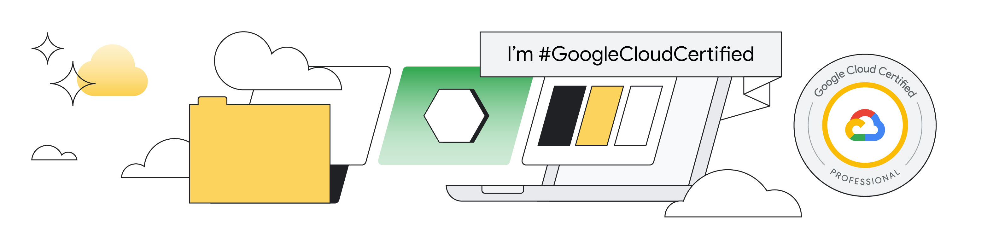

### Hi Friends  

 

As a Professional Machine Learning Engineer and seasoned Senior Data Scientist, adept, and accomplished Control System Engineer specializing in Planning and Decision Making, I thrive at the intersection of cutting-edge technologies. My current focus lies in harnessing the power of Machine Learning (ML), Computer Vision (CV), Natural Language Processing (NLP), and Deep Learning (DL) to craft innovative applications and software solutions.

With expertise spanning multiple programming languages, including Python, Java, JavaScript, and C/C++, I bring a versatile skill set to every project. My work not only revolves around building ML and AI-driven applications but also extends to optimizing system performance and decision-making processes.

In addition to my professional endeavors, I am a passionate advocate for open source communities. I actively contribute to various projects and channel my enthusiasm for NLP and Algorithms into creating and nurturing new initiatives. Explore my GitHub repositories to discover a wealth of projects and ideas at the forefront of technology and data science.

- 📝 Visit [C.Cui Blog](https://cuicaihao.com/) to find interesting articles.
- 🔭 I’m currently a Tech Lead and working on recommendation systems for the largest retail business in Australia.
- 🌱 I have been practicing Software Product Management (SPM) for a few private projects related the stock market and funds analysis since 2019.
- 😎 Keep building on my project on Quantitative Trading and Stock Ranking Software.
- ⚡ Fun Fact: I originally planned to be an artist/painter, but accidentally got on the ship of Science and Technology~
- 🤔 2025 Goals:
  - [x] Keep being role model and targeting the top 10% in Teams.
  - [x] Keep supporting academic communities by offering feedbacks as reviewer and associate editor, please send review invitation to **caihao.cui[at]ieee.org**.
  - [x] Keep writing my blogs of technology or algorithm applications on my website.
  - [ ] Publish one paper on academic journals in 2025 on AI application in industry.
  - [x] Contribute more to the Deep Learning Open Source projects ([TensorFlow](https://github.com/tensorflow), [PyTorch](https://github.com/pytorch) and [PaddleX](https://github.com/PaddlePaddle)).

📕 **Latest 10 Posts on My Blog**
<!-- BLOG:START -->
- [Our Future with AI: Three Strategies to Ensure It Stays on Our Side](https://cuicaihao.com/2025/05/31/our-future-with-ai-three-strategies-to-ensure-it-stays-on-our-side/)
- [2024 Guest Lecture Notes: AI, Machine Learning and Data Mining in Recommendation System and Entity Matching](https://cuicaihao.com/2024/10/19/2024-guest-lecture-notes-ai-machine-learning-and-data-mining-in-recommendation-system-and-entity-matching/)
- [Is the AI PC a Gimmick or a Faster Carriage?](https://cuicaihao.com/2024/05/26/is-the-ai-pc-a-gimmick-or-a-faster-carriage/)
- [AI Revolutionizes Industry and Retail: From Production Lines to Personalized Shopping Experiences](https://cuicaihao.com/2024/05/25/ai-revolutionizes-industry-and-retail-from-production-lines-to-personalized-shopping-experiences/)
- [The Future of Coding: Will Generative AI Make Programmers Obsolete?](https://cuicaihao.com/2024/05/04/the-future-of-coding-will-generative-ai-make-programmers-obsolete/)
- [Enigma – Mission X Challenge Accomplished with Python](https://cuicaihao.com/2024/04/20/enigma-mission-x-challenge-accomplished-with-python/)
- [Prompt Engineering for LLM](https://cuicaihao.com/2024/02/04/prompt-engineering-for-llm/)
- [Technical Review 04:  Human-Computer Interface from In-Context Learning to Instruct Understanding](https://cuicaihao.com/2023/12/09/technical-review-04-human-computer-interface-from-in-context-learning-to-instruct-understanding/)
- [Technical Review 03: Scale Effects &amp; What happens when LLMs get bigger and bigger](https://cuicaihao.com/2023/11/12/technical-review-03-scale-effects-what-happens-when-llms-get-bigger-and-bigger/)
- [Technical Review 02: Data and Knowlege for Large Language Model &lpar;LLM&rpar;](https://cuicaihao.com/2023/10/30/technical-review-data-and-knowlege-for-large-language-model-llm/)
<!-- BLOG:END -->
---

👨🏻‍💻 **Open Source Project**

[SplitRaster](https://pypi.org/project/splitraster/)

      

SplitRaster is a Python Package to split a large image into small tiles. It is useful for deep learning and computer vision tasks. The package can also be used to split a large image into small tiles with geo-information embedded, like `tif`, `tiff`. 
  

  - Github: https://github.com/cuicaihao/split_raster
  - Pypi: https://pypi.org/project/splitraster/
  - Tutorial with Docs:  https://cuicaihao.github.io/split_raster/

 
📖 **Tech Stack & Tools** 

<code></code> 
<code></code>
<code></code>
<code></code>
<code></code>
<code></code>
<code></code>
<code></code>
<code></code>
<code></code>
<code></code>
<code></code> 
<code></code>
<code></code>
<code></code>
<code></code>
<code></code>
<code></code>
<code></code>
<code></code>
<code></code>
<code></code>
<code></code>
<code></code>
<code></code>
<code></code>
<code></code>
<code></code>
<code></code> 
<code></code>
<code></code>
<code></code>
<code></code>
<code></code>
<code></code>
<code></code>
<code></code>
<code></code>
<code></code>
<code></code>
<code></code>
<code></code>
<code></code>
<code></code>

---