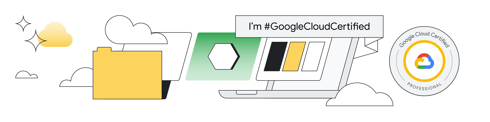

### Hi Friends  

I'm a Machine Learning Engineer and Data Scientist specializing in ML, NLP, CV, DL, GenAI, and Agentic AI. I develop practical, intelligent applications that push boundaries in machine learning and automation.

As Tech Lead in large-scale retail, I've optimized recommendation systems and operational efficiency using advanced ML and generative AI. I specialize in building autonomous agentic systems leveraging LLMs for intelligent decision-making.

Proficient in Python, Java, JavaScript, and C/C++, I build robust AI-powered systems—from production ML pipelines to agentic workflows. Active in open source, contributing to projects in NLP, algorithms, and generative AI.

- 📝 Visit [C.Cui Blog](https://cuicaihao.com/) to find interesting articles.
- 🔭 I’m currently a Tech Lead and working on recommendation systems for the largest retail business in Australia.
- 🌱 I have been practicing Software Product Management (SPM) for a few private projects related the stock market and funds analysis since 2019.
- 😎 Keep building on my project on Quantitative Trading and Stock Ranking Software.
- ⚡ Fun Fact: I originally planned to be an artist/painter, but accidentally got on the ship of Science and Technology~
- 🤔 2026 Goals:
  - [x] Publish 6 long blogs in 2025 on AI application in industry.
  - [x] Keep writing my blogs of technology or algorithm applications on my website.
  - [x] Keep supporting academic communities by offering feedbacks as reviewer and associate editor, please send review invitation to **caihao.cui[at]ieee.org**.
  - [x] Keep being role model and targeting the top 10% in Teams.

📕 **Latest 10 Posts on My Blog**
<!-- BLOG:START -->
- [Creating Gods Gives Hope, Destroying Them Gives Self-Esteem: Behind the &quot;Deification&quot; and &quot;Reversal&quot; of Public Figures](https://cuicaihao.github.io/posts/2026-09-02-creating-gods-gives-hope-destroying-them-gives-self-esteem/)
- [Scientific Research: Investment Can Be Planned, But Breakthroughs Cannot Be Scheduled — A Discussion Inspired by Two Fields Medals](https://cuicaihao.github.io/posts/2026-08-30-scientific-research-investment-can-be-planned-but-breakthroughs-cannot-be-scheduled-a-discussion-inspired-by-two-fields-medals/)
- [Unpacking AI Model Open Source: What&#39;s Truly &#39;Open&#39;? A Full Panorama from Open Weights, Business Closed Loops, to Enterprise Adoption](https://cuicaihao.github.io/posts/2026-08-30-unpacking-ai-model-open-source-whats-truly-open-a-full-panorama-from-open-weights-business-closed-loops-to-enterprise-adoption/)
- [When Social Conflict Becomes a Recommendation Signal: Why Recommendation Algorithms Cannot Stay Neutral](https://cuicaihao.github.io/posts/2026-08-30-when-social-conflict-becomes-a-recommendation-signal/)
- [Do Enterprises Really Need AI Agents? When to Let Models Decide the Next Step](https://cuicaihao.github.io/posts/2026-08-26-ai-agents-in-the-enterprise-when-to-cede-control-over-next-steps/)
- [How AI Foundation Models Address Scaling Bottlenecks: Mathematical Structures, Algorithm Design, and Systems Engineering](https://cuicaihao.github.io/posts/2026-08-25-mathematical-and-algorithmic-ideas-that-changed-ai-over-the-last-decade-from-scaling-bottlenecks-to-foundation-models/)
- [Unmasking AI Vulnerabilities: The Challenge of LLM Safety and Jailbreaking](https://cuicaihao.github.io/posts/2026-08-24-unmasking-ai-vulnerabilities-the-challenge-of-llm-safety-and-jailbreaking/)
- [Is Enterprise RAG Worth It? From Choosing Use Cases to Ongoing Governance](https://cuicaihao.github.io/posts/2026-08-23-is-enterprise-rag-worth-implementing-from-scenario-selection-to-ongoing-governance/)
- [Why You Must Still Write Down Your Ideas in the Age of AI](https://cuicaihao.github.io/posts/2026-08-23-why-you-must-still-write-down-your-ideas-in-the-age-of-ai/)
- [Why an AI Animated Series Can Reach Eleven Seasons: From Generative Models to Production Systems](https://cuicaihao.github.io/posts/2026-08-22-why-an-ai-animated-series-can-reach-eleven-seasons/)
<!-- BLOG:END -->
---

👨🏻‍💻 **Open Source Project**

[SplitRaster](https://pypi.org/project/splitraster/)

     

SplitRaster is a Python Package to split a large image into small tiles. It is useful for deep learning and computer vision tasks. The package can also be used to split a large image into small tiles with geo-information embedded, like `tif`, `tiff`.
  
- Github: <https://github.com/cuicaihao/split_raster>
- Pypi: <https://pypi.org/project/splitraster/>
- Tutorial with Docs:  <https://cuicaihao.github.io/split_raster/>

📖 **Tech Stack & Tools**

<code></code>
<code></code>
<code></code>
<code></code>
<code></code>
<code></code>
<code></code>
<code></code>
<code></code>
<code></code>
<code></code>
<code></code>
<code></code>
<code></code>
<code></code>
<code></code>
<code></code>
<code></code>
<code></code>
<code></code>
<code></code>
<code></code>
<code></code>
<code></code>
<code></code>
<code></code>
<code></code>
<code></code>
<code></code>
<code></code>
<code></code>
<code></code>
<code></code>
<code></code>
<code></code>
<code></code>
<code></code>
<code></code>
<code></code>
<code></code>
<code></code>
<code></code>
<code></code>
<code></code>

---
